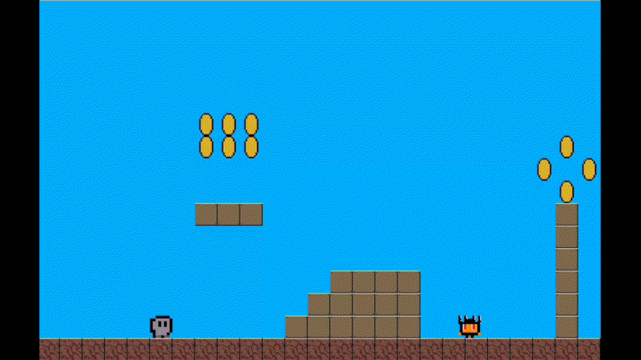

## A Noob's 2D-Platformer Game made in C++ and SDL2

After watching a couple of videos from the YouTube channel
[NesHacker](https://www.youtube.com/@NesHacker), I was inspired to create my own
2D Platformer. These are the videos I'm talking about:
- [The Code That Makes Mario Move](https://www.youtube.com/watch?v=ZuKIUjw_tNU).
- [How NES Games Use State Machines For Everything](https://www.youtube.com/watch?v=8lZ53Sx5oc0).
- [NES Graphics Explained](https://www.youtube.com/watch?v=7Co_8dC2zb8).

The primary objective was to create a 2D platformer from scratch without relying
on an existing game engine. The game is written in C++, and I used SDL2 for
rendering textures onto the screen. After some initial OOP headaches, I did some
research on game development. This is when I learned about what an ECS is, and I
decided to make one myself. It isn't the greatest ECS ever, but it definitely
relieved my OOP headaches and made everything more modular. The project
structure, Makefile and some of the code still needs improvement.

## Features
- A custom ECS.
- Physics/Movement System.
- Collision System.
- In-Game-Object Interaction.
- Dynamic Camera Movement.
- Animation System for the player, coins, and enemies.
- AI System for enemies.
- Render System.

## Gameplay
- Controlling the player:
  - **Left Arrow:** Move to the left.
  - **Right Arrow:** Move to the right.
  - **Up Arrow:** Jump.

- Game objective:
  - You **win** if you collect all coins.
  - You **lose** if you get hit by an enemy.

## Dependencies
- SDL2
   - ``sudo apt-get install libsdl2-dev``
- SDL\_image
   - ``sudo apt-get install libsdl-img-dev``
- At least C++20 compiler standard.

## Building
- Execute ``make`` to build the project.
- Start the game by executing the `./game` file.

## Future Plans
This project was more of a learning experience for me, and the initial goals I
set for myself have been achieved.

